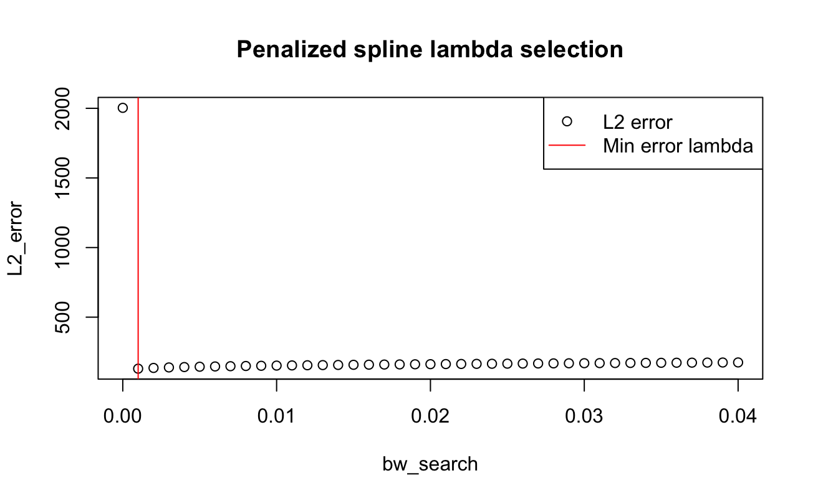

\newcommand{\Var}{\operatorname{Var}}

```{r setup, include = FALSE}
knitr::opts_chunk$set(
  warning = FALSE,
  collapse = TRUE,
  comment = "#>"
)
```

# Theory of Splines

Splines are piecewise polynomial functions with some differentiability and
continuity conditions, typically used for interpolation or smoothing of points.
Their name derives from the historical usage of strips of wood which could be
stretched up or down to interpolate points. For the same reason, the set of
points which define the intervals of the piecewise function are known as knots.

The simplest way to calculate a spline estimation of a 2-dimensional cloud of
points is to use the x-values as knots for the _truncated power basis._
We will also need to choose the order for the spline, which we will denote \( M \).
An M-spline \(r\) has degree \(M-1\) and, since it is a piecewise polynomial, has
continuous \(r', \dots, r^{(m - 2)}\) at each knot \(\xi_i\).
The most common method is to use 4-splines, which are cubic.

Given some knots \(\tau_1, \dots, \tau_k\), and an order \(M\), we can construct
a truncated power basis. It takes the form:
\[
x^0, x^1, \dots, x^{M - 1}, (x - \tau_1)^{M - 1}_{+}, \dots, (x - \tau_K)^{M - 1}_{+}
\]
This is a basis for the space of cubic splines with these knots, a four dimensional
vector space over \(\mathbb{R}\). Any such spline can be written as a linear
combination of the elements of this basis (denoted \(\psi_{j}\)):
\[ r(x) = \sum_{j = 1}^{k + M} \beta_{j} \psi_{j}(x) \]
Because the spline takes this form, polynomial regression splines can be found
with OLS, minimizing the sum of squared errors.
\[
\begin{aligned}
J &= k + M \\
\hat{y} &= \beta_1 \psi_1(x) + \dots + \beta_J \psi_J(x) \\
\hat{\symbf{\beta}} &= \arg \min \sum \left( y_i  - \sum_{j = 1}^{J} \beta_j \psi_j(x_i) \right)
\end{aligned}
\]

Citation: _All of Nonparametric Statistics_, Wasserman, and "Nonparametric
regression using kernel and spline methods", Opsomer and Breidt 2016.

### B-splines and linear smoothers

B-splines (short for basis splines) are a basis with compact support, which makes computations less
intensive. Most software packages thus perform spline regression by projecting
onto the basis of B-splines.
To calculate B-splines, we start by defining (arbitrary) additional \( 2M \) knots outside of the
support of the function to estimate.
\[
\tau_1 \le \dots \le \tau_m \le \tau_1 \le \dots \le \tau_k \le \tau_{k + m + 1} \le \dots \le \tau_{k + 2m}
\]
Then, the B-spline functions are defined recursively in terms of lower degree basis functions,
starting with the zeroth degree basis functions, which is a simple (scaled) indicator function
per knot.
The \(i\)-th basis function of degree k is denoted by \(B_{i,k}(x) and is defined recursively as follows:
\[
\begin{aligned}
B_{i, 0}(x) &= c \symbf{1}\{ \tau_{i}, \tau_{i + n} \} \\
\sum_{i} B_{i, 0}(x) &= 1
\end{aligned}
\]
Then, higher order B-splines are calculated through recursion:
\[B_{i,k+1}(x) = \frac{x - \tau_{i}}{\tau_{i + k + 1} - \tau_{i}} B_{i,k}(x) +
  \frac{\tau_{i + k + 2} - x}{\tau_{i + k + 2} - \tau_{i + 1}} B_{i+1,k}(x) \]

The degree of the b-spline basis functions determines the smoothness of the resulting spline function.
Higher degree basis functions result in smoother curves, but can also be more computationally expensive to calculate.

## Application to density estimation

We can also use our method of regression by OLS on the spline basis functions
for density estimation after transforming the problem. We used the `logspline`
R package to do this.

# Regression with Splines

We used the `logspline` R package, which is based on the theory of Kooperberg and Stone.
The method is to estimate \(\log(f) \) by a function \(s \in S\) with maximum likelihood estimation
We are choosing from the space \(S_0\) of cubic smoothing splines with fixed knots at order statistics.
Then, normalize with a constant \(c\), so \(\hat{\log f} = \hat{\ell} = \hat{s} + c(\hat{s}) \), where \(c\) makes \(\int \exp \{ \hat{\ell} \} = 1\).
This can be done by iterating over combinations of B-splines and calculating MLEs.
This reduces the problem of density estimation to OLS, and the main choice we have is knot selection.
This comes from
"A study of logspline density estimation", Charles Kooperberg and Charles J. Stone (1991)
and "Large Sample Inference for Log-Spline", Stone (1990)

## Regression: Buja, Hastings, and Tibshirani

We also used the pspline package in our calculations. The method used by this
package is described here.
Let \( h_i = x_{i + 1} - x_i \), \( \Delta \) and \((n - 2) \times n \) matrix,
  \( C \) a symmetric matrix.
\( \Delta \) and \( C \) are tridiagonal, \(\Delta_{i, i} = \frac{1}{h_{i}} \), \( \Delta_{i, i + 1} = -(\frac{1}{h_i} + \frac{1}{h_{i + 1}})\),
  and \( \Delta_{i, i + 2} = \frac{1}{h_{i + 1}}\),
 and \(C_{i-1, i} = C_{i, i - 1} = \frac{h_{i}}{6} \)
  and \( C_{i, i} = \frac{h_{i} + h_{i + 1}}{3}\).
\[ K = \Delta^t C^{-1} \Delta, S = (I + \lambda K)^{-1}, \hat{y} = Sy \]

The below are examples for \(n = 5\).
\[ \Delta = \begin{bmatrix}
\frac{1}{x_2 - x_1} & -(\frac{1}{x_2 - x_1} + \frac{1}{x_3 - x_2}) & \frac{1}{x_3 - x_2} & 0 & 0 \\
0 & \frac{1}{x_3 - x_2} & -(\frac{1}{x_3 - x_2} + \frac{1}{x_4 - x_3}) & \frac{1}{x_4 - x_3} & 0 \\
0 & 0 & \frac{1}{x_4 - x_3} & -(\frac{1}{x_4 - x_3} + \frac{1}{x_5 - x_4}) & \frac{1}{x_5 - x_4} \\
\end{bmatrix} \]

\[ C = \begin{bmatrix}
\frac{(x_2 - x_1) + (x_3 - x_2)}{3} & \frac{x_3 - x_2}{6} & 0 \\
\frac{x_3 - x_2}{6} & \frac{(x_3 - x_2) + (x_4 - x_3)}{3} & \frac{x_4 - x_3}{6} \\
0 & \frac{x_4 - x_3}{6} & \frac{(x_4 - x_3) + (x_5 - x_4)}{3}
\end{bmatrix} \]
Solving for the smoothing spline is equivalent to minimizing
\[ \lVert y - \hat{y} \rVert^{2} + \lambda \hat{y}^{t} K \hat{y} \]
where \( K = \Delta^t C^{-1} \Delta \), and \( \hat{y} = (I + \lambda K)^{-1} y \).

Citation: "Linear Smoothers and Additive Models," Buja, Hastie, Tibshirani.
Annals of Statistics, 17:2, 1989, 453--510.

## Natural Splines and Linear Smoothers

Another reason to use splines is that minimizing the penalized sum of squares gives a natural spline
\[ M(\lambda) = \sum_{i} (y_{i} - \hat{r_{n}}(x_{i}))^{2} + \lambda J(r) \]
which has \(\xi_i = x_i\), knots at the data points.
These splines are also linear smoothers.
\[ \ell_{i}(x) \approx \frac{1}{f(x_{i})} K_{h}(x_{i}) \]
This result is proven in Silverman 1984.
The method of penalized regression is elaborated below.

# Penalized Regression (Hao)

Notably, the risk of overfitting rises as we increase the number of
knots.

In this case, the penalty is used to prevent overfitting, therefore we
don't need to worry about the selection of knot size.

To ensure sufficient flexibility and allow the penalty to prevent
overfitting, we can simply tie a sizable number of knots---let's say 20,
for example.

As explained before, the second derivative of a quadratic plus function
is

\[\frac{d^{2}}{dx^{2}}(x - t)_{+}^{2} = 2(x - t)_{+}^{0}\]

That means if we are using quadratic splines, then the spline's second
derivative jumps by an amount 2\(b_{k}\) at the \(k^{th}\) knot, and
this is shown in the red circles.

Overfitting occurs when there are many jumps (many knots) and the jumps
are unconstrained.

The sum of the squared jumps is

\[4\sum_{k = 1}^{K}\mspace{2mu} b_{k}^{2}\]

The sum of squared residuals and the sum of squared leaps are two
quantities that we want to be as minimal as possible, so we add them
with a weight \(\lambda\).

\[\begin{aligned}
\beta\hat{} = \arg\begin{array}{r}
\min \\
\beta \\
\end{array}\sum_{i = 1}^{n}\mspace{2mu}\left\{ Y_{i} - \left( \beta_{0} + \beta_{1}x + \beta_{2}x^{2} + b_{1}\left( x - t_{1} \right)_{+}^{2} + \cdots \right.\  \right.\  \\
 & \left. \ \left. \  + b_{K}\left( x - t_{K} \right)_{+}^{2} \right) \right\}^{2} + \lambda\sum_{k = 1}^{K}\mspace{2mu} b_{k}^{2}. \\
\end{aligned}\]

Alternatively, one can use this equation from Wasserman, All of Nonparametric Statistics.
\[
\hat{\beta} = \arg \min_{\beta} \sum_{i = 1}^{n} \left(
y_{i} - \sum_{j = 1}^{J} \beta_{j} \psi_{j}(x_{i}) \right)^{2}
+ \lambda \sum_{j = 1}^{J} \beta_{j}^{2}
\]

The penalty parameter can be any value between 0 and ∞, inclusive. If
\(\lambda\  = \infty\), then \(b_{1},\ .\ .\ .\ ,\ b_{k}\) are
constrained to be zero since any positive value of these parameters
makes the penalty infinite. This makes the quadratic spline equal to a
single quadratic polynomial.

If \(\lambda\  = \ 0\) then there is no penalty and we are using OLS or
ordinary least squares.

In fact, a decent middle ground between these two options is to select
an appropriate \(\lambda\).

For example, we compare the fits with \(\lambda\) equal to 0, 5, and
10\textsuperscript{10} in the right graph. We can see that the fit with
\(\lambda\  = \ 10^{10}\) has little flexibility. It is a quadratic
polynomial fit. The fit with \(\lambda\  = \ 0\) is the OLS to a 25-knot
spline to be an overfit. Using \(\lambda\  = \ 5\) is a good compromise
between these two extremes.

One question is how to find the optimal choice of \(\lambda\) that gives
us the most accurate predictions of new data. Cross-validation is a
technique that can precisely select \(\lambda\).

We can remove one data point, estimate the regression function using the
remaining data, and then use the estimated regression function to
forecast the deleted observation to assess how well utilizing a certain
trial value of works for prediction. Each data point in the sample can
be used as the deleted point in this process, which can be repeated n
times. As a result, we have \(n\) different estimates of the predicted
squared prediction error when employing this.

To be specific, it follows the basic steps:

For \(j = 1,\ldots,n\), let \(\widehat{s}( \cdot ;\lambda, - j)\) be
the regression function estimated using this λ and with the \(j^{th}\)
data point deleted.

\[\begin{aligned}
 & \sum_{i \neq j}^{}\mspace{2mu}\left\{ Y_{i} - \left( \beta_{0} + \beta_{1}x + \beta_{2}x^{2} + b_{1}\left( x - t_{1} \right)_{+}^{2} + \cdots \right.\  \right.\  \\
 & \left. \ \left. \  + b_{K}\left( x - t_{K} \right)_{+}^{2} \right) \right\}^{2} + \lambda\sum_{k = 1}^{K}\mspace{2mu} b_{k}^{2}. \\
\end{aligned}\]

Let \(s( \cdot ;\lambda, - j)\) be the prediction of the value of
\(Y_{j}\) using the other observations. Define

\[CV(\lambda) = n^{- 1}\sum_{j = 1}^{n}\mspace{2mu}\left\{ Y_{j} - s\left( X_{j};\lambda, - j \right) \right\}^{2}\]

to be the average squared error from these \(n\) predictions.

The value of that minimizes CV (\(\lambda\)) is regarded as the best
since CV (\(\lambda\)) calculates the expected squared prediction error.
The regression function's final estimate makes use of all the
information and the value of that minimizes CV.

The \(1\  + \ p\  + \ K\) parameters, the intercept, the \(p\)
coefficients of the powers \(x\) to \(x^{p}\), and the \(K\)
coefficients of the plus functions are present if we employ a pth degree
spline with \(K\) knots.

If \(\lambda = 0\), then all of these parameters are free to vary. If
\(\lambda = + \infty\) , the estimated coefficients of the plus function
are all be constrained to equal 0, so there are only \(1\  + \ p\) free
parameters.

If \(0＜\lambda\ ＜ + \infty\), then the "effective number of
parameters" should be somewhere between \(1\  + \ p\) and
\(1\  + \ p\  + \ K\). We use the complex matrix to measure the
effective number of parameters.

\[\mathbf{X} = \begin{pmatrix}
1 & X_{1} & \cdots & X_{1}^{p} & \left( X_{1} - t_{1} \right)^{p} & \cdots & \left( X_{1} - t_{K} \right)^{p} \\
1 & X_{2} & \cdots & X_{2}^{p} & \left( X_{2} - t_{1} \right)^{p} & \cdots & \left( X_{2} - t_{K} \right)^{p} \\
 \vdots & \vdots & \ddots & \vdots & \vdots & \ddots & \vdots \\
1 & X_{n} & \cdots & X_{n}^{p} & \left( X_{n} - t_{1} \right)^{p} & \cdots & \left( X_{n} - t_{K} \right)^{p} \\
\end{pmatrix}\]

If \(D\) is a square matrix \((1\  + \ p\  + \ K)(1\  + \ p\  + \ K)\)
with all off-diagonal elements equal to zero and its diagonal elements
equal to \(1\  + \ p\) zeros then \(K\) ones, then this is the case.
When this is the case, the effective number of parameters, also known as
the effective degrees of freedom (DF), is

\[{DF}(\lambda) = {trace}\left\{ \left( \mathbf{X}^{\top}\mathbf{X} \right)\left( \mathbf{X}^{\top}\mathbf{X} + \lambda\mathbf{D} \right)^{- 1} \right\}\]

If \(\lambda = 0\)

\[DF(0) = trace\left\{ \left( \mathbf{X}^{\top}\mathbf{X} \right)\left( \mathbf{X}^{\top}\mathbf{X} \right)^{- 1} \right\} = trace\left( \mathbf{I}_{1 + p + K} \right) = 1 + p + K\]

Let \(\widehat{s}( \cdot ;\lambda, - j)\) be the estimated regression
function using all the data. Then

\[{\widehat{\sigma}}^{2}(\lambda) = \frac{\sum\left\{ Y_{i} - \widehat{s}\left( X_{i};\lambda \right) \right\}^{2}}{n - DF(\lambda)}\]

A simpler method to measure CV (\(\lambda\)) is to calculate the
generalized cross-validation statistic (GCV)

\[GCV(\lambda) = \frac{n^{- 1}\sum\left\{ Y_{i} - \widehat{s}\left( X_{i};\lambda \right) \right\}^{2}}{\left\{ 1 - \frac{{DF}(\lambda)}{n} \right\}^{2}}\]

Compared with CV (\(\lambda\)), \(GCV(\lambda)\) only uses the estimate
\(\widehat{s}\) computed from all the data. Of course, this would lead
to some derivation from the correct value.

we can define AIC for P-splines as

\[AIC(\lambda) = n\log\left\{ {\widehat{\sigma}}^{2}(\lambda) \right\} + 2DF(\lambda)\]

We can then select \(\lambda\) by minimizing AIC.

There are several methods for the same question. Let's make a
comparation. Time series analysts created AIC, parametric statistics
gave rise to CV, and nonparametric regression, notably spline
estimation, introduced GCV. Researchers from three independent teams
approached the same broad issue and came up with three comparable, yet
distinct, solutions. Given that Cp is comparable to CV, GCV, and AIC,
there were actually four similar responses.

Let's make a summary. Splines that are fitted by penalized least squares
are known as penalized splines. The sum of squared residuals and a
penalty for the spline's roughness are reduced by penalized least
squares. A nonnegative penalty parameter, here indicated by, multiplied
by the sum of the squared coefficients of the plus functions is a
typical roughness penalty. It's important to choose correctly, and
generalized cross-validation (GCV) is a useful tool for doing so.

# Numerical Studies (Shengxuan)

To further explore the properties and behaviors of splines, we decided to conduct four numerical experiments: Density estimation with simulated data, density estimation with real data, spline regression with simulated data and spline regression with real data. 

## Density estimation with simulated data
To start, we would consider a density estimation problem with known underlying distribution to test the performance of the spline density estimator. This will require an R package called "logspline". We would like to compare this with the kernel density estimator (KDE). 

### Experiment setup
In order to generate random samples, we have to first define the distribution where the samples are drawn from. To make the density estimation more challenging, we will consider a 3-mode Gaussian mixture that has the following parameters: Mean = (-5, -2, 4), s.t.d. = (0.6, 0.6, 1.5), p = (0.25, 0.25, 0.5). The "p" is the probability of drawing sampling from a particular mode. We will generate 1000 data points for this study. 

To select bandwidth or parameters of the "logspline" function, each package already implemented their own selection method. For kernel density estimator, "bw.bcv" was used. For "logspline", the built-in selection method is used. 

To evaluate to performance of each method, we approximate the integrated mean squared error (IMSE) for each method by performing Monte Carlo simulation (1000 times) and Riemann sum for approximation of the integral over x. 

### Results and discussion


In this figure, the rug of the data points, the true distribution, the histogram of the data and the density estimates from the two methods for one realization were plotted. Looking at the estimated densities from both methods, both of them performed very well visually. A little bit over estimate at the peak for spline and a more jaggy estimate for KDE is observed. In terms of IMSE, logspine" out performed KDE. 

## Density estimation with real data

It is always good to examine how methods work for real life data to make sure results we see in simulation can be translated to practice. In this experiment, we choose the Fiji Earthquake depth data from Wasserman (2005). It contains 1000 observations. 

### Experiment setup

To solve the problem of evaluating algorithm with no known distribution (`groundtruth`), we splitted the data randomly in training (25%) and test set (75%). The large portion of the data is used to generate a reliable reference or approximated ground truth. By having less data, we put more pressure on the estimator and is easier for us to spot the difference between the two methods. 

The bandwidth selection procedure is the same as the previous experiment. 

Since we don't know the true distribution (`groundtruth`), the evaluation method needs to be different. Here, we proposed two ways to evaluate the algorithms: log-liklihood given the test data and comparing the empirical cdf of the test data with the estimated cdf's. 

Computing the log-likelihood of the two model given the test data will give us something related to the probability of observing the test data given the estimated model being true. The higher the log-likelihood, the better the data fits the model, which is desired. 

When the estimated density is exactly the same as the true density, the distance between their cdf will be 0. by comparing the distance between the cdf's also gives us a measure of the performance. Here, \(L^2\) distance was used for simplicity. 

### Results and discussion


The estimated densities were plotted in figure 2, along with the rug and histogram of the test set data.
The two methods behaved very differently here. The logspline estimate is very
spiky near 0 and kernel density estimate is more jagged and with obvious edge bias.
This is possibly due to the logspline model being more flexible, and perhaps
the number of data points is not enough for "bw.bcv" to choose an optimal
bandwidth for KDE. In terms of log-likelihood, logspline outperformed KDE. 


By looking at the cdf plot, visually they are surprisingly similar.
The edge bias of the KDE estimate can be seen near 0.
The \(L^2\) distance also indicates the logspline estimate is closer to the test set distribution.

## Spline regression with simulated data

In this numerical study, we are also interested in the application of splines to regression problems.
In this experiment, we will start with simulation data. At the same time, this is a good place to look into the effect of penalization term on the estimate, since we have the true distribution in simulation study.
We will need the R package "spline"in this and the following study.
As a comparison, we decided to use local polynomial regression implement by function "loess" and penalized spline regression function in package `pspline`.

### Experiment setup
To make the regression problem more challenging, here we consider a pairwise constant function and added white Gaussian noise with s.t.d. 0.5. 1024 observations, one at each x value, were generated. Once the data set is generated, the data set was split to training (75%) and test set (25%). 

We choose 2nd degree polynomial to allow more flexible model since the package only allow degree 0-2. For spline, we decided to use cubic spline since it is very common. The evaluation of the method is the same as the density estimation problem with simulated data. 

Since there is no written function for bandwidth selection in either cases, bandwidth selection is implemented using custom written cross validation algorithm. In this algorithm, the training set was split to 3 fold and the model was used to fit onto two sets. The sum of square validation error was computed using the thrid fold of the training data and this process repeats for two more times by holding out other folds. The cross validation error was averaged and the bandwidth the minimized the averaged cross validation error was used as the final bandwidth. This method was used for bandwidth in local polynomial, the degrees of freedom in spline regression and the tuning parameter \(\lambda\) in penalized spline regression. 

### Results and discussion


Bandwidth selection for local polynomial went well. With some trial-and-error, we were able to identify the approximated bandwidth that minimizes the cross validation error. 


For spline, the degree of freedom selection potentially had some issues. R threw warning messages about the matrix condition and knot locations near the boundary. This might be due to the degree of freedom being to small or too large. When looking at the objective function values, it goes up and down when varying the degree of freedom. Regradless, we still picked the one that minimizes the cross validation error from the set of degree of freedom values we choice. 


Despite the challenges we had in the hyperparameters step, the fit for both of the methods work pretty nicely. In terms of IMSE, the local polynomial actually outperformed spline regression. This is perhaps expected since the ringing artifacts of the spline is much stronger than local polynomial. 


To understand better how the penalization term works and if it helps improve the prediction, one can try the same procedure with penalized spline. The "pspline" package does not allow us to specify the degree of spline so only the tuning parameter \(\lambda\) was chosen using cross validation. The cross validation error for \(\lambda\) is somewhat surprising at the first glance. The \(\lambda\) that minimizes the cross validation is the one that is barely above 0. The cross validation goes way up when \(\lambda\) was set to 0 and it also went up monotonically as we increased \(\lambda\), for the set of \(\lambda\) we tried. 



Even though the \(\lambda\) selection had weird phenomenon, the selected \(\lambda\) actually resulted in a smaller IMSE compared to regular spline regression implemented by "spline". The local polynomial IMSE is still the lowest out of the three. 


As we varied the \(\lambda\) value, the smoothing effect clearly showed up in the fit, which is very satisfying to see. This numerical results are align with the theory of spline regression. 

Interestingly, when setting \(\lambda\) to 0, the resulting model is not the same as the model from "spline" and the model is severely overfit. This can be explained by the way "pspline" implements spline regression: pspline does not specify the order of spline and only uses \(\lambda\) to control for smoothness of the model; while "spline" package uses the spline order or the degree of freedom of the marix to control the behaviors of the model. When we set \(\lambda\) to 0, the "pspline" function will find a spline model that has arbitary order and try to fit that to the data, which causes the overfit. 

The small \(\lambda\) is perferred mainly due to the fact we have a very not smooth function. When applying penalty on the second derivatives of the estimate, we are enforcing smoothness of the function. However, the starcase funciton is discontinuous in theory and has many "jumps". This is the exacy opposite of what the penalty term is trying to do. As the results, in order to minimize the cross validation error, the penalty term needs to be kept very small while not to small to cause overfit. Because of this mismatch of the two packages, this comparison is perhaps not the very fair and we should look more into R packages that allows one to specify the order of the spline while also have the penalty feature available.  

## Spline regression with real data
Last but not least, we would liek to try out the spline regression on real data. The dataset we choose is the Lidar data from Wasserman (2005). Here, the "logratio" is the response and the "range" is the predictor. 

### Experiment setup
The data was split to training (70%) and test set (30%). The bandwidth selection is the same as the last experiment for both local polynomial and the spline regression. Only regular spline using the "spline" package was considered in the experiment. The evaluation criterion is the sum of squared serror of the test set data. 

### Results and discussion


The bandwidth selection for local polynomial was also very reasonable. The R again threw error for the selection of degree of freedom in spline regression, although the objective function values did not look at bad as the last experiment. 


Quite interestingly, both methods performed very similarly for this problem. The IMSEs were almost identical and it was hard to conclude which method is more appropriate. In addition, the test set data was not big and majority of the SSE came from the tail of the dataset and unfortunately, there was little data at the tail after data splitting. This makes the resutls harder to interpret. Perhaps a slightly different data splitting ratio will help. 

# Conclusions

We dived into the theory of spline in nonparametric statistics and its usages in practice. Both regular and penalized spline were discussed from a theoretical standpoint. The numerical studies showcased the power of spline and demonstrated that both KDE, local polynomial regression and their spline version are useful in practice. By leveraging the different characteristics of different methods, one should choose the model that works the best for their application. 


```
# Appendix

The following R code was used to prepare the empirical section of this paper.

# \scriptsize
# \lstinputlisting[language=R, breaklines=true, postbreak=\mbox{\textcolor{red}{$\hookrightarrow$}\space}]{./code.R}
```
